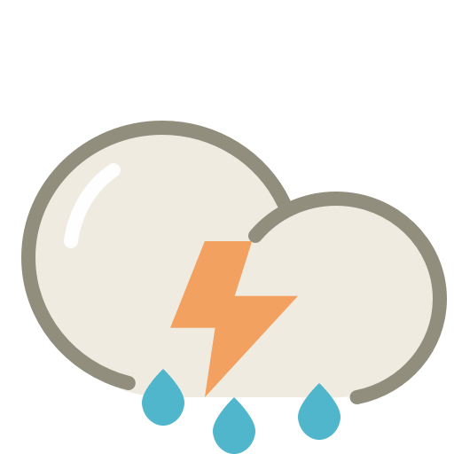

# WEATHER-TODAY: Weather search App.

[Live Demo](https://gilded-bavarois-ce9ea9.netlify.app/) | [GitHub Repository](https://github.com/Alike73/WEATHER-TODAY)

## Technologies
  

WEATHER-TODAY is a React.js web application that allows users search current weather around the world. 

## Installation:

1. **Create folder Weather App**

   git clone https://github.com/Alike73/WEATHER-TODAY.git
   cd frontend

2. **Install Dependencies:**
`npm install`

3. **Run the App:**
  `npm start` or `npm run start`

6. **Access the App:**
   Open your web browser and navigate to http://localhost:3000 to access AMBIENT-FLOW.

7. **Before running your App go to the: https://home.openweathermap.org/users/sign_in, and create your own apiKey and apiUrl.**

8. **Inside the Weather.js put your own apiKey and apiUrl.**

## Usage

1. **To find current weather. Type your city in the search input and click button search or press enter key.**
   
   And you will see current weather in your location.

## Technologies Used

1. **React.js:**
    Front-end JavaScript library for building user interfaces.
3. **Bootstrap**
    To make app is responsive, so feel free to use it on different devices and screen sizes.
5. **CSS:**
    Styling and layout design.

## Contributions
   Contributions to WEATHER-TODAY are welcome! If you have suggestions, bug reports, or feature requests, 
   please submit an issue or pull request on the GitHub repository.

## License
  WEATHER-TODAY is released under the free usage.
  You can copy, modify and so on.

  Happy searching the weather with WEATHER-TODAY! 
  If you have any questions or need assistance,

 ##  Feel free to contact me at: 

  